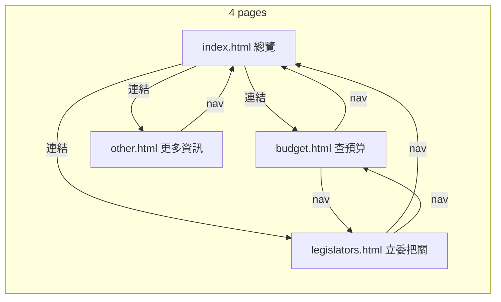

# 拆頁面資訊架構重構計畫

## 目標

將目前單一 HTML（[index.html](index.html)）內以 `showPage('home'|'page-budget'|'page-legislator')` 切換的三個「虛擬頁」改為**多個獨立 HTML 頁面**，頂部導覽只保留 3～4 個連結，每頁只保留該任務需要的內容與互動，減少重複入口與點擊。

---

## 新頁面結構

| 頁面   | 檔名                 | 導覽名稱 | 主要內容                                                         |
| ---- | ------------------ | ---- | ------------------------------------------------------------ |
| 總覽   | `index.html`       | 總覽   | Hero（含查預算／立委把關 CTA）、審查進度、115 分配、歷年比較、部會比較、部會詳細分析、Top 5 排行 |
| 查預算  | `budget.html`      | 查預算  | 機關篩選＋審查結果圖、搜尋列、結果列表、分頁、計畫詳情 Modal                            |
| 立委把關 | `legislators.html` | 立委把關 | 黨籍篩選、委員卡片、委員詳情 Modal                                         |
| 更多資訊 | `other.html`       | 更多資訊 | 相關新聞外連、資料來源與誤差說明、使用方式／FAQ                                    |

---

## 實作策略

### 1. 多檔 HTML + 共用資源

- **每個頁面一個 HTML 檔**：`index.html`（總覽）、`budget.html`、`legislators.html`、`other.html`。
- **共用**：同一份 [styles_vs.css](styles_vs.css)、[vs-modules/*.js](vs-modules/)、[main_vs.js](main_vs.js)、`img/`、`data_page_*.json`。
- **頂部導覽**：每頁內嵌同一組 nav，連結改為 `<a href="index.html">總覽</a>`、`<a href="budget.html">查預算</a>`、`<a href="legislators.html">立委把關</a>`、`<a href="other.html">更多資訊</a>`。當前頁以 `<body>` 的 class 或 data 屬性標記（例如 `class="page-overview"`），nav 用該標記為當前連結加上 `nav-active`（可每頁寫死，或一小段 inline script 讀取後套用）。

### 2. 每頁只放該頁需要的 DOM

- **index.html（總覽）**：保留 Hero、`#section-review-progress`、`#section-review-stats`（總體審查圖＋Top 5）、歷年比較、115 分配、部會比較、部會詳細分析、**移除**左側 `spec-sidebar`、右側 `nav-wheel`、首頁內「預算計畫搜尋」整區（搜尋改到 budget 頁）。Hero 只保留 2 個 CTA：「看整體審查進度」（捲動到審查進度）、「查預算」（連到 `budget.html`）；「立委把關」改為連到 `legislators.html`。Top 5 區的「看完整分析 → 預算審查頁」改為連到 `budget.html`。
- **budget.html**：只放「各機關審查結果」區（部會/機關篩選＋圖表）、「預算計畫搜尋」區（搜尋列、熱門關鍵字、結果列表、分頁）、以及 **unifiedModal**（工作計畫詳情）。不需 Hero、不需審查進度／分配／部會詳細分析等區塊。
- **legislators.html**：只放黨籍篩選、委員卡片網格、以及 **detailModalC**（委員刪減/凍結提案紀錄）。不需 unifiedModal。
- **other.html**：靜態區塊：相關新聞（外連中央社）、資料來源與誤差說明（目前散落在各處的說明文集中到此）、使用方式或 FAQ。無需圖表與 modal。

#### 現有總覽區塊 ID 對照（避免搬移時命名混淆）

- `section-review-progress`：預算審查進度區。
- `section-review-stats`：總體審查圖＋Top 5 外層區。
- `section-agency-review-home`：Top 5 排行容器（位於 `section-review-stats` 內）。

### 3. JS 依「當前頁」與 DOM 存在與否分支

- **頁面辨識**：以 `<body class="page-overview">`、`page-budget`、`page-legislators`、`page-other` 辨識。在 [main_vs.js](main_vs.js) 開頭讀取 `document.body.classList` 或 `document.body.dataset.page` 決定 `currentPage`。
- **資料載入**：改為依頁載入，避免未用到的請求。  
  - 總覽：`fetchData('page-a')`、`fetchData('page-b')`、`fetchData('page-d')`（審查進度、分配、部會分析、Top 5、摘要卡）。  
  - 查預算：`fetchData('page-a')`、`fetchData('page-b')`。  
  - 立委：`fetchData('page-c')`。  
  - 更多資訊：不載入資料。
- **初始化**：所有依 DOM 的 init（例如 `initMinistrySection`、`initBudgetPageFilters`、`renderHomeStatusChart`、`renderHomeCutFreezeCards`、搜尋、立委列表、modal 綁定）改為**先檢查對應節點是否存在**再執行（例如 `if (document.getElementById('section-agency-review-home')) { ... }`）。這樣同一份 [main_vs.js](main_vs.js) 與 [vs-modules](vs-modules/) 可被四頁共用，不會報錯。
- **移除 showPage / 虛擬分頁**：刪除 `showPage(pageId)` 及依賴它的邏輯（nav 按鈕切頁、sidebar 切頁、nav-wheel 切頁）。改為真實導向：`window.location.href = 'budget.html'` 或 `<a href="budget.html">`。若需保留「從總覽帶關鍵字到查預算」，可用 `budget.html?q=關鍵字`，在 budget 頁 on load 讀取 `URLSearchParams` 並填入搜尋框並觸發搜尋。
- **Nav 搜尋行為調整**：`handleNavSearch` 不再捲動到首頁 `#section-plan-search-home`，改為直接導向 `budget.html?q=關鍵字`；budget 頁初始化時讀取 `q` 並自動搜尋。
- **跨頁錨點處理**：`scrollToSection` 原本會 `showPage(hostPage.id)`，拆頁後改為 `window.location.href` 導向對應頁（可附帶 hash），同頁才做 `scrollIntoView`。

### 4. 導覽與連結精簡

- **總覽頁**：頂部 nav 僅 4 個連結（總覽、查預算、立委把關、更多資訊）。移除 `spec-sidebar`、`nav-wheel`。
- **查預算／立委／更多資訊**：同樣頂部 nav 4 個連結；頁內不再重複「回首頁」以外的多餘導覽。
- **隱藏用 header**：目前 [index.html](index.html) 內 `display:none` 的 `<header>` 與其內 nav 可刪除或改為僅在無 float-nav 時備援；新架構以 float-nav 為唯一頂部導覽。

### 5. Modals 與共用 UI

- **Loader / Error**：每頁保留共用的 `#loader`、`#error-display`（或改為 toast），資料由該頁自行 fetch。
- **unifiedModal**：只出現在 `budget.html`（計畫詳情）。總覽頁 Top 5 若點擊某計畫，改為導向 `budget.html?plan=計畫編號` 或 `?q=計畫名`，在 budget 頁開啟並可自動開啟該計畫的 modal。
- **detailModalC**：只出現在 `legislators.html`。
- **既有流程修正**：凡原本 `closeModal(..., 'detailModalC'); showPage('page-budget');` 的流程，改為 `window.location.href = 'budget.html'`（必要時保留查詢參數）。

### 6. 檔案對應與搬移

| 現有                                                        | 重構後                                                                                                        |
| --------------------------------------------------------- | ---------------------------------------------------------------------------------------------------------- |
| index.html 整份                                             | 拆成 4 個 HTML：index.html（總覽）、budget.html、legislators.html、other.html。從現有 index 複製並刪減各頁不需要的 section 與 modal。 |
| main_vs.js 的 showPage、restoreState(activePage)            | 改為依 body class 判斷頁面；移除 showPage；restoreState 僅在 budget 頁處理搜尋關鍵字/分頁，其他頁不還原 activePage。                        |
| navigation-state.js 的 savePage / restoreState(activePage) | 可保留 saveSearchState 供 budget 頁；activePage 相關邏輯移除。                                                          |
| vs-modules/dom-map.js 的 section 對應                        | 僅總覽頁需要錨點捲動時保留；其他頁無錨點可簡化或保留不影響。                                                                             |

---

## 建議實作順序

1. **建立 4 個 HTML 骨架**：以現有 `index.html` 為基底拆成 4 份（若要保留舊版先備份），每份刪除其他頁專屬的 section 與 modal，並為 body 加上 `page-overview` / `page-budget` / `page-legislators` / `page-other`；nav 改為 `<a href="...">` 並在當前頁加上 active class。
2. **調整 main_vs.js**：加入 `currentPage` 判斷；將 DOMContentLoaded 內的 fetch 改為依 `currentPage` 只載入該頁需要的資料；所有 init 加上「節點存在才執行」的守衛。
3. **移除總覽頁**：左側 sidebar、右側 nav-wheel、首頁搜尋區；Hero CTA 與 Top 5 CTA 改為連到 budget / legislators / other。
4. **刪除 showPage 及依賴**：移除 `showPage()`、nav 的 onclick 切頁、sidebar/wheel 的切頁邏輯；改為連結或 `location.href`。
5. **（可選）budget 頁支援 ?q=**：on load 讀取 `q` 參數並填入搜尋框並觸發搜尋；總覽 Top 5 可帶 `budget.html?q=...`。
6. **建立 other 頁內容**：集中相關新聞、資料來源說明、使用方式／FAQ。
7. **測試**：總覽／查預算／立委／更多資訊 四頁各自載入、導覽、搜尋、modal 皆正常；無多餘點擊路徑。

### 測試核對清單（最小可交付）

- [ ] 四個頁面皆可獨立載入，Console 無錯誤。
- [ ] 四頁頂部 nav 連結正確，當前頁 active 樣式正確。
- [ ] `budget.html?q=...` 會自動帶入並執行搜尋。
- [ ] `budget.html?plan=...` 可自動開啟對應計畫 modal（若該功能啟用）。
- [ ] `legislators.html` 的 `detailModalC` 可正常開關與顯示資料。
- [ ] Loader / Error 在各頁 fetch 失敗時能正確顯示。

### 拆頁後品質檢核流程（Skill 工作流）

每完成一頁的拆分後，依序執行以下四步驟；全部 4 頁完成後，再跨頁跑一次完整流程。

1. **`frontend-design`**（專案層級 `.cursor/skills/frontend-design`）
   - 調整版面、排版、CTA 與導覽層次、視覺一致性。
2. **Vercel Web Design Guidelines**（個人全域 `~/.cursor/skills/`）
   - UI/UX + a11y 結構稽核：語意化 HTML、label、鍵盤操作、焦點樣式、導覽一致性。
3. **`web-quality-skills`**（個人全域 `~/.cursor/skills/`）
   - 效能 / Core Web Vitals 檢查：LCP、CLS、INP、blocking resources、資源載入最佳化。
4. **AccessLint**（個人全域 `~/.cursor/skills/`，選用）
   - 若很在意 WCAG：做細部 a11y 檢查（對比度、link purpose、僅靠顏色區分的提示）。

---

## 注意事項

- 若需保留現有 `index.html` 或 `index_vs.html` 作為舊版，可將新總覽頁命名為 `index.html` 並把舊版改名備份。
- 四頁共用同一份 JS/CSS，故任一修改會影響所有頁面；init 守衛可避免在缺少 DOM 的頁面報錯。
- 更多資訊頁（other）若暫不實作，可先做 3 頁（總覽、查預算、立委），nav 暫時只顯示 3 個連結，之後再補 other 與第四個連結。
- 每個新頁面建議補上專屬 `<title>` 與 meta description，避免四頁共用同一組 SEO 文案。
